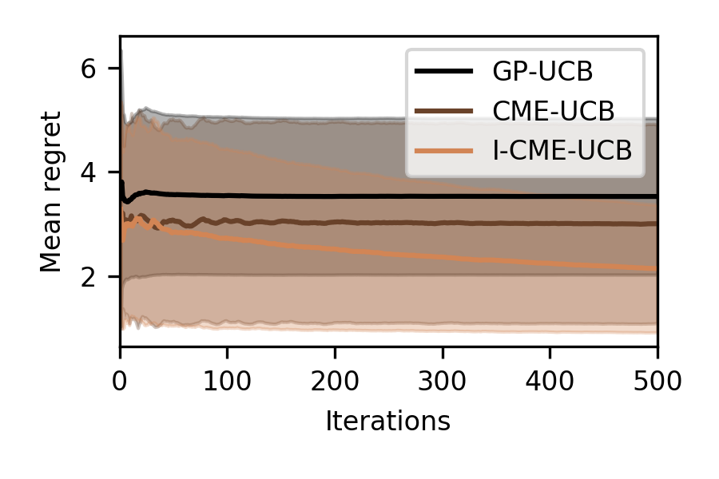

# Active Learning of Conditional Mean Embeddings via Bayesian Optimisation
Code repository for the paper:
>  Chowdhury, Sayak Ray, Rafael Oliveira, and Fabio Ramos. 2020. “Active Learning of Conditional Mean Embeddings via 
>Bayesian Optimisation.” In Proceedings of the 36th Conference on Uncertainty in Artificial Intelligence (UAI). PMLR 
>volume 124.

Available at:
- Paper: http://auai.org/uai2020/proceedings/469_main_paper.pdf
- Supplement: http://auai.org/uai2020/proceedings/469_supp.pdf

## Requirements
The code is based on Python 3.7. To run the code, we recommend creating a Python 3.7 virtual environment, with e.g.
 Anaconda, and then installing the requirements within the virtual environment:

```setup
pip install -r requirements.txt
```

## Toy experiment
You can run the toy experiment in the paper with:
```shell script
python toy_experiment.py
```

## Plots
A Jupyter notebook `plotting.ipynb` is provided with code to plot the optimisation performance. The notebook loads the
output files of `toy_experiment.py` , which are named as `<method_name>-regret.pth` and saved to the current directory.
For convenience, the regret data files used to generate the plots in the paper are provided, so that the following plot
can be reproduced with the notebook.
 
 